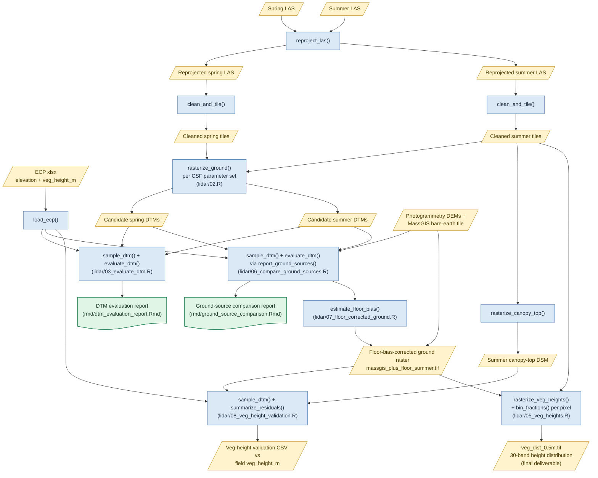

# Lidar pipeline architecture

This document explains how the lidar pipeline works: the conceptual
workflow, and which script and function implements each step.
It is scoped to the lidar pipeline only —
the hydrology (`inundation_metrics/`) and
`logger_recalibration/` pipelines are separate and not covered here.

## How this relates to other docs

To avoid duplicating (and then diverging from) the content below,
other lidar docs stick to their own lane:

- **This document** — conceptual workflow and implementation:
  what each stage does, which script and function does it,
  how data flows between stages.
- [`lidar/readme.md`](readme.md) — the project goal ("dream output"),
  site priorities, raw data source locations,
  and the CRS/vertical-bias investigation narrative.
- [`CRS.md`](../CRS.md) (project root) — the project-wide
  CRS/datum/geoid standard, decided independently of any one
  pipeline stage.
- [`dev/workplan.md`](../dev/workplan.md) — the currently active,
  still-open work items.
- [`dev/worklog.md`](../dev/worklog.md) /
  [`dev/worklog-archive.md`](../dev/worklog-archive.md) — dated
  history of what was done and why, including findings and bugs
  fixed along the way.

## Conceptual overview

For each site, the pipeline starts from two raw point clouds
collected in the same year: a **spring** flight (minimal vegetation,
used as the ground reference) and a **summer** flight (full
vegetation, used for the height signal). From those it produces:

1. A **DTM** (digital terrain model) — bare-earth elevation,
   validated against field-collected elevation control points
   (ECPs).
2. A **vegetation-height distribution raster** — a multi-band GeoTIFF
   where each pixel holds the fraction of summer lidar returns
   falling in each of 30 height bins above the ground reference
   (5 cm bins 0–1 m, then 20 cm bins 1–3 m).

Along the way, the ground reference used for (2) turned out not to
be the site's own spring DTM: DTM validation showed all UAS-derived
sources carry a positive elevation bias against ECPs (spring lidar
least of all, but still biased), while a MassGIS aerial-lidar tile
for the same area does not. The pipeline therefore builds a hybrid
ground reference — MassGIS elevation, shifted by an estimated
instrument-level offset — and validates that choice against
field-measured vegetation heights before using it. See "Pipeline
stages" below for how, and `dev/worklog.md` (2026-08-24) for the
full investigation.

## Where things live

- **`lidar/*.R`** — numbered driver scripts, one per pipeline stage,
  intended to be run in order for a given site. Each sources all of
  `R/` and is self-contained (re-runnable from a cold start).
- **`R/*.R`** — one function per file (matching filename), shared
  across the whole repo, not just lidar. Drivers source them all
  via `lapply(list.files("R/", ...), source)`.
- **`rmd/*.Rmd`** — parameterized R Markdown report templates,
  rendered by `report_dtms()` and `report_ground_sources()` rather
  than knitted directly.
- **`lidar/data/paths.yml`** — a `pathtools` path scheme: every raw
  input cloud/ECP path (fully enumerated — the 2022/2024+ naming
  conventions are too irregular for a template), plus every
  scratch/output path template (`cleaned_tiles`, `ground_raster`,
  `dtm_eval_report`, etc.). Drivers resolve paths via
  `pathtools::get_path("<entry>", site = , date = , ...)` rather than
  hardcoding them. See `dev/path_lookup_plan.md` for the migration
  this replaced (`paths.csv` + `R/update_path.R`).
- **`../lidar_reports/<site>_*/`** — a sibling directory to the repo,
  entirely outside git: cached per-DTM/per-source ECP-sample CSVs and
  rendered HTML reports (`ground_comparison_report`,
  `dtm_eval_report` entries in `paths.yml`).
- **`E:/uas_scratch/lidar/<site>/<date>/`** — large derived rasters
  and point-cloud tiles, not committed. Namespaced by
  `target_epsg` so a CRS-standard change doesn't collide with prior
  output: `reprojected/`, `zzzcleaned_epsg<N>/`,
  `zzzraster_epsg<N>/`, `zzzheights/`.

Every driver currently hardcodes `site` (and often `date`) as a
top-of-file parameter rather than looping over sites — see
`dev/workplan.md`'s Phase 3 for the site-by-site rollout status.

## Pipeline stages

Each stage below names the driver, the `R/` functions it calls, and
its inputs/outputs. Function names link to their roxygen docs in
`R/`.

### Step 0 — conditional reprojection

Source clouds arrive in WGS 84 (horizontal) + WGS 84 ellipsoidal
height (vertical); everything downstream needs the project's target
CRS (`CRS.md`: NAD83(2011) / Massachusetts Mainland State Plane,
EPSG:6491, + NAVD88 via GEOID18). `las_needs_reprojection()` checks
the LAS header and skips this step if the source is already in the
target CRS. Otherwise `reproject_las()` dispatches to
`reproject_las_pdal()` (default) or `reproject_las_lastools()`
(needs a paid `lasvdatum` license — see `lidar/readme.md`).

- **Driver:** `lidar/02.R` (top of file).
- **Input:** raw LAS resolved via `get_path("raw_lidar", site = , date = )`
  from `lidar/data/paths.yml`.
- **Output:** `<base_output>/reprojected/*_epsg<N>_navd88.las`.

### Step 1 — clean & tile

`clean_and_tile()` filters to last return, removes noise via
`lidR::sor()`, and writes cleaned tiles using `lidR::LAScatalog` +
`catalog_map()`. Skip-if-exists: safe to call repeatedly.

- **Called from:** `lidar/02.R` (spring or summer, whichever site is
  configured) and again from `lidar/05_veg_heights.R` and
  `lidar/08_veg_height_validation.R` for the summer cloud
  specifically (skips if `lidar/02.R` already produced the tiles).
- **Output:** `<base_output>/zzzcleaned_epsg<N>/*.las`.

### Step 2 — CSF ground rasterization (DTM tuning grid)

For each row of a small hand-picked CSF (Cloth Simulation Filter)
parameter grid, `rasterize_ground()` classifies ground points and
interpolates a DTM via k-NN IDW, writing one GeoTIFF per parameter
set. `get_path("ground_raster", ...)` resolves the output filename
from the parameter values, per the `ground_raster` template in
`lidar/data/paths.yml`.

- **Driver:** `lidar/02.R` (main loop).
- **Input:** cleaned tiles (Step 1).
- **Output:** `zzzraster_epsg<N>/csf_th<...>_res<...>_rgd<...>_<res>m.tif`,
  one per grid row.

### Step 3 — DTM evaluation against ECPs

`load_ecp()` reads and tidies the all-sites ECP spreadsheet (filters
to `type = "training"`, drops "Logger Array" points, returns an
`sf` object in the target CRS). For each candidate DTM,
`sample_dtm()` bilinearly samples elevation at every ECP location
(caching to a CSV next to the DTM), then `evaluate_dtm()` computes
residuals and a full metric set (bias, RMSE, MAE, quantiles,
slope, `bias_p`) broken out overall and by ECP `type`, plus
diagnostic plots (`plot_pred_vs_obs()`, `plot_residual_map()`,
`plot_residual_hist()`, `plot_residual_vs_elevation()`,
`plot_qq_residuals()`, via `summarize_residuals()`).

- **Driver:** `lidar/03_evaluate_dtm.R` → `report_dtms()`.
- **Report:** `rmd/dtm_evaluation_report.Rmd`.
- **Output:** `../lidar_reports/<site>_<date>/dtm_eval_summary.csv` +
  HTML report + PNG plots.

### Ground-source comparison

Before committing to a ground reference for vegetation heights, the
best CSF DTMs are compared against every other available ground
elevation source for the site — photogrammetry DEMs and a MassGIS
aerial-lidar bare-earth tile — using the same `sample_dtm()` +
`evaluate_dtm()` stack, just pointed at different rasters.

- **Driver:** `lidar/06_compare_ground_sources.R` →
  `report_ground_sources()`.
- **Report:** `rmd/ground_source_comparison.Rmd`.
- **Finding:** MassGIS beats every UAS-derived source by a wide
  margin at every site tested, with near-zero bias.
- **Output:** `../lidar_reports/<site>_ground_comparison/` (per-source
  ECP CSVs, `ground_source_comparison.csv`, HTML report).

### Floor-bias-corrected ground reference

MassGIS's near-zero bias makes it the accuracy winner, but it
doesn't share the UAS point cloud's own instrument-level vertical
offset — using it unmodified would leave that offset uncancelled in
every vegetation-height measurement. `estimate_floor_bias()` isolates
just the instrument-level component of the UAS bias from the cached
DTM-vs-ECP residuals (excluding vegetation-contaminated outliers;
`plot_floor_bias()` is its diagnostic companion), and that offset is
added to the (CRS-reprojected) MassGIS raster.

- **Driver:** `lidar/07_floor_corrected_ground.R`.
- **Input:** cached ECP-sample CSVs from the ground-source
  comparison step.
- **Output:** `zzzraster_epsg<N>/massgis_plus_floor_summer.tif`.

### Vegetation-height validation

Because ECPs also carry a field-measured `veg_height_m`, the
floor-bias-corrected ground reference can be validated directly
against ground truth rather than by construction alone.
`rasterize_canopy_top()` builds a top-of-canopy DSM (a high
percentile of raw `Z` per pixel, analogous to `rasterize_ground()`
but not ground-normalized) from the summer cleaned tiles; predicted
vegetation height (canopy top minus each candidate ground) is
compared against `veg_height_m` via `sample_dtm()` +
`summarize_residuals()`.

- **Driver:** `lidar/08_veg_height_validation.R`.
- **Output:** `../lidar_reports/<site>_ground_comparison/veg_height_validation.csv`.

### Vegetation height distribution (final deliverable)

`rasterize_veg_heights()` normalizes summer point heights against
the chosen ground raster and bins them per pixel via
`bin_fractions()` (a top-level per-cell metric function — it must not
be nested, since `lidR`'s chunked dispatch doesn't preserve closures
referenced only inside a `pixel_metrics()` formula), writing a
30-band GeoTIFF where each band is the fraction of returns in that
height bin.

- **Driver:** `lidar/05_veg_heights.R`.
- **Input:** summer cleaned tiles (Step 1) + the floor-bias-corrected
  ground raster.
- **Output:** `zzzheights/veg_dist_<res>m.tif`.

## Data flow

Rectangles are functions/scripts; parallelograms are data artifacts
(point clouds, tiles, rasters, cached CSVs); the document-shaped,
green boxes are the two rendered HTML reports.

## See also

- [`lidar/readme.md`](readme.md) — goals, site priorities, data
  source locations, CRS/bias background.
- [`CRS.md`](../CRS.md) — the project-wide CRS/datum/geoid standard.
- [`dev/workplan.md`](../dev/workplan.md) — active open items.
- [`dev/worklog.md`](../dev/worklog.md) — dated history and findings.
